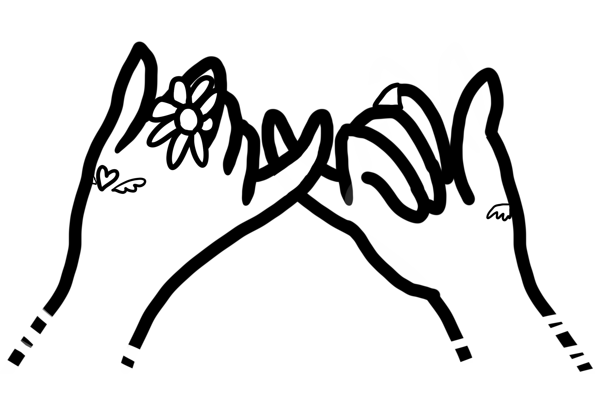

# Pinky Promise

* 約束のしるしとして小指を引っ掛け合うこと

## 条件

*  手がおなじになること

## ディレクトリ構成

```
.
├── docs
├── images
│   ├── left  # 左手用デコレーション画像
│   └── right # 右手用デコレーション画像
├── index.js  # ジェネレート用コード
```

## 使い方

```
generatePinkyImage("いか", "かし")
```


